# Projeto iPhone - Modelagem e Implementação

Este é um projeto solicitado no Bootcamp da DIO e simula a modelagem e a implementação de funcionalidades de um **iPhone**, abordando três funcionalidades principais:

- **Reprodutor Musical**
- **Aparelho Telefônico**
- **Navegador na Internet**

## Funcionalidades

- **Reprodutor Musical**: Permite ao usuário tocar, pausar e selecionar músicas.
- **Aparelho Telefônico**: Permite ao usuário fazer chamadas, atender ligações e iniciar o correio de voz.
- **Navegador na Internet**: Permite ao usuário exibir páginas da web, adicionar novas abas e atualizar páginas.

## Estrutura do Código

O código é estruturado utilizando **interfaces** para representar os diferentes componentes de funcionalidades do iPhone. A classe principal **iPhone** implementa essas interfaces, fornecendo as funcionalidades desejadas.

### Classes e Interfaces

1. **Interfaces**:
   - `ReprodutorMusical`: Métodos para tocar, pausar e selecionar música.
   - `AparelhoTelefonico`: Métodos para ligar, atender e iniciar o correio de voz.
   - `NavegadorInternet`: Métodos para exibir páginas, adicionar novas abas e atualizar páginas.

2. **Classe Principal**:
   - `iPhone`: Implementa as interfaces e possui as funcionalidades de **ReprodutorMusical**, **AparelhoTelefonico** e **NavegadorInternet**.

## Diagrama UML

A estrutura do projeto é representada pelo diagrama UML abaixo, que mostra como as interfaces e a classe principal se relacionam:

